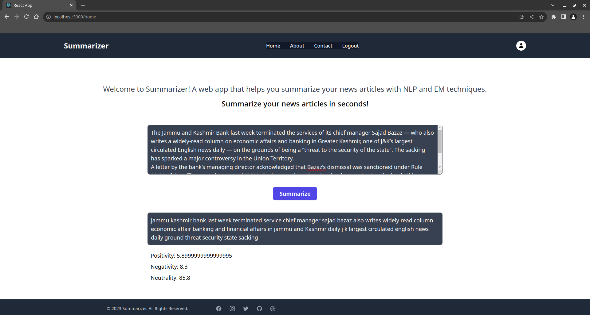

<h1 align="center"> News Article Summarizer</h1>

A news article summarizer that uses the HuggingFace transformers library to generate summaries. The model used is bart-large. The model is trained on the CNN/DailyMail dataset. The model is deployed using FastAPI and React.

bart-large model: https://huggingface.co/facebook/bart-large-cnn

## Installation
To install all the required libraries run the following command.

`pip install requirements.txt`

To install tailwind & other packages, run the following command

`npm install`

Add your own API key and config in the firebase.js file.

## Demo

Run both frontend and backend in different terminals.

React frontend command:

`npm start`

fastapi backend command:

`uvicorn main:app --reload`

 </img>